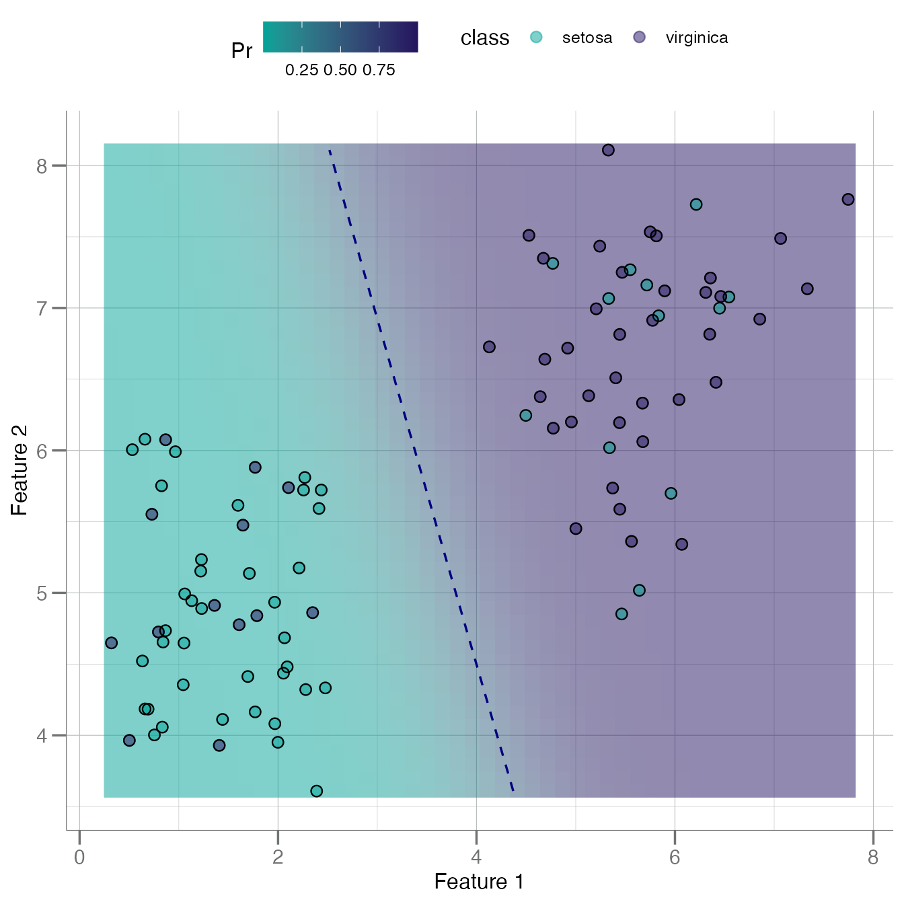
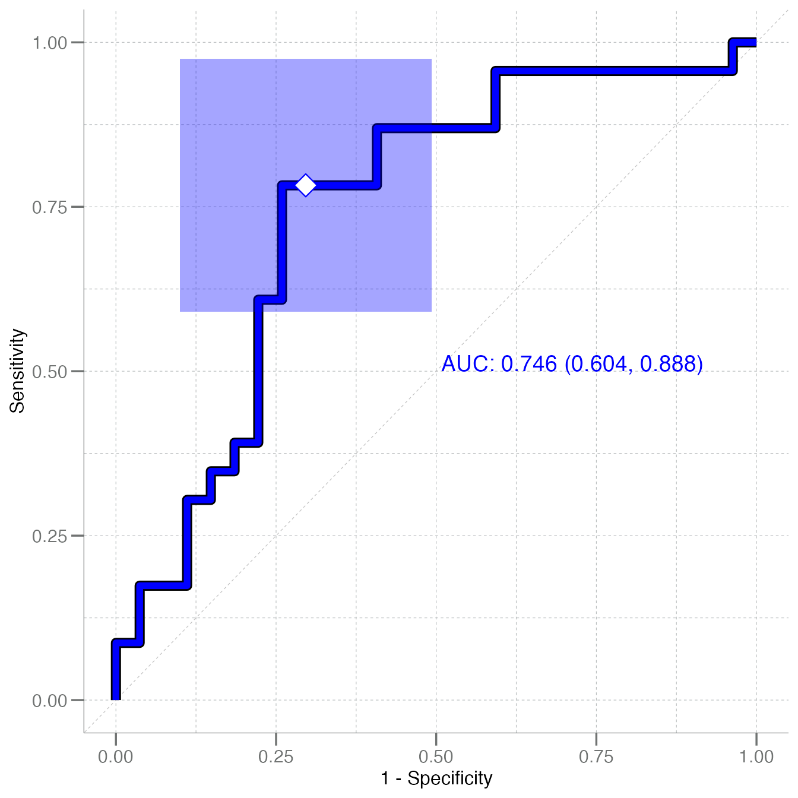
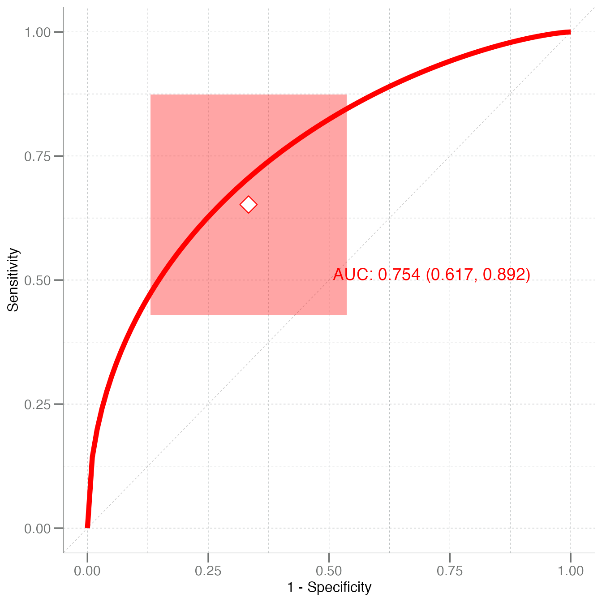

# Introduction to libml

The `libml` package contains general functions necessary for the
analysis of biomarker data via statistical and machine learning
techniques, calculating KS distances, k-fold cross-validation,
classification performance metrics, and ROC plotting.

------------------------------------------------------------------------

## Introduction

The `libml` package provides functions to create training datasets,
perform univariate tests (via the
[`calc_univariate()`](https://stufield.github.io/libml/dev/reference/calc_univariate.md),
train classifiers, and plot ROC curves. The models types supported in
this package are primarily geared toward:

- Naive Bayes
- Random forest
- Logistic regression

There is also limited support for `k`-nearest neighbors models. With the
exception of “robust” Naive Bayes, these models are created using the
associated R packages directly. The `libml` package provides wrappers
for performing cross validation, making predictions, and creating ROC
curves.

This package is biased toward *binary* classification and as a result
many of the functions assume only two classes exist. To keep track of
which class is the positive class, a `tibble` called a `tr_data` object
is defined for use in this package. The “Response” column is a `factor`
class, ordered so that the *positive* class is the **second** label.
These `tr_data` data frames can be created using the
[`create_train()`](https://stufield.github.io/libml/dev/reference/create_train.md)
function.

ROC curves and other related functions all on a standard input
consisting of:

- **truth**: a vector of actual class labels
- **predicted**: a *numeric* vector (in the same order as `truth`) of
  class predictions

------------------------------------------------------------------------

## Functionality

### Training Data

Training data objects created using
[`create_train()`](https://stufield.github.io/libml/dev/reference/create_train.md)
from an `data.frame` object. The
[`create_train()`](https://stufield.github.io/libml/dev/reference/create_train.md)
function can subset the data based on the i information passed in the
`...` (passed to
[`dplyr::filter()`](https://dplyr.tidyverse.org/reference/filter.html)
and are labeled by the `group_var =` argument. A “Response” column to
the end of the data frame corresponding to the classes. The negative and
positive classes are the grouped according to this column and a
[`dplyr::group_by()`](https://dplyr.tidyverse.org/reference/group_by.html)
call, creating a “grouped tibble” object. For example: consider the
simple case where groupings are defined by a single meta data field
called `Species`:

``` r

add_noise <- function(x) x + rnorm(length(x), sd = 3)
tr <- tr_iris
class(tr)
#> [1] "tr_data"    "tbl_df"     "tbl"        "data.frame"
```

As is typical with
[`dplyr::filter()`](https://dplyr.tidyverse.org/reference/filter.html),
multiple conditions can be added as desired:

``` r

tr2 <- create_train(iris, Species == "setosa", Sepal.Length > 5,
                    group_var = Species)
```

------------------------------------------------------------------------

## Model Fitting

### Splitting Train vs Test Sets

A *very* convenient method to split a data set into training and test
sets is:

``` r

# Add a sample identifier variable for the anti_join()
tr <- dplyr::mutate(tr, id = dplyr::row_number())

train <- tr |>
  dplyr::sample_frac(size = 0.5)        # random selection of rows @ 50%

test <- tr |>
  dplyr::anti_join(train, by = "id") |> # use anti_join to get the sample setdiff
  dplyr::select(-id)                    # remove identifier

train <- dplyr::select(train, -id)      # remove identifier
```

### Robust Naive Bayes

This function fits a naive Bayes model using *robustly* calculated
parameters, i.e. calculated using a least-squares fit to a Gaussian
cumulative distribution function rather than simply `stats::mean()` and
[`stats::sd()`](https://rdrr.io/r/stats/sd.html). This engine comes from
`globalr::fit_gauss()`, with starting parameter values calculated via
[`stats::median()`](https://rdrr.io/r/stats/median.html) and
[`stats::mad()`](https://rdrr.io/r/stats/mad.html) passed to
[`stats::nls()`](https://rdrr.io/r/stats/nls.html).

``` r

nb <- fit_nb(Species ~ ., data = train)
nb
#> 
#> Robust Naive Bayes Classifier for Discrete Predictors
#> 
#> Call:
#> fit_nb.formula(formula = Species ~ ., data = train)
#> 
#> A-priori probabilities:
#> Species
#>    setosa virginica 
#>      0.46      0.54 
#> 
#> Conditional densities:
#> # A tibble: 4 × 5
#>   parameter       Sepal.Length Sepal.Width Petal.Length Petal.Width
#>   <chr>                  <dbl>       <dbl>        <dbl>       <dbl>
#> 1 setosa_mu              5.37        3.53          1.87       0.523
#> 2 virginica_mu           6.28        3.11          4.55       1.57 
#> 3 setosa_sigma           0.979       0.682         1.14       0.872
#> 4 virginica_sigma        0.844       0.508         2.51       1.21
```

#### Plotting a Bivariate Naive Bayes Boundary

If you would like to see how a naive Bayes boundary looks in 2
dimensions:

``` r

data.frame(F1    = tr$Petal.Length,
           F2    = tr$Sepal.Length,
           class = tr$Species) |>
  plot_bayes_boundary(pos_class = "virginica")
```



### Random Forest

Random forest models are often used in proteomic analyses, and there are
numerous functional tools to investigate and interrogate these models,
e.g. [`get_gini()`](https://stufield.github.io/libml/dev/reference/get_gini.md):

``` r

rf <- randomForest(Species ~ ., data = train)
get_gini(rf)
#> # A tibble: 4 × 2
#>   Feature      Gini_Importance
#>   <chr>                  <dbl>
#> 1 Sepal.Length            7.51
#> 2 Petal.Length            5.73
#> 3 Petal.Width             5.69
#> 4 Sepal.Width             5.44
```

------------------------------------------------------------------------

## Model Performance

As one might expect, there are numerous functions for evaluating model
performance in [`libml`](https://stufield.github.io/libml/dev/index.md).
Many S3 methods are provided to the S3 generic
`globalr::calc_predictions`,
e.g. [`calc_predictions.glm()`](https://stufield.github.io/libml/dev/reference/s3-calc_predictions.md).
The following are a few of the standard metrics:

### Confusion Matrix

``` r

pred_nb <- calc_predictions(nb, test)
pred_nb
#> # A tibble: 50 × 3
#>    pred_class prob_setosa prob_virginica
#>    <chr>            <dbl>          <dbl>
#>  1 virginica    0.00279           0.997 
#>  2 virginica    0.000252          1.000 
#>  3 virginica    0.000678          0.999 
#>  4 setosa       0.881             0.119 
#>  5 virginica    0.0000108         1.000 
#>  6 virginica    0.00365           0.996 
#>  7 setosa       0.944             0.0558
#>  8 virginica    0.000295          1.000 
#>  9 setosa       0.984             0.0162
#> 10 setosa       0.977             0.0233
#> # ℹ 40 more rows

calc_confusion(test$Species, pred_nb$prob_virginica,
               pos_class = "virginica", cutoff = 0.5)
#> ── Confusion ───────────────────────────────────────────────────────────────────────────────────────
#> 
#> Positive Class: virginica
#> 
#>            Predicted
#> Truth       setosa virginica
#>   setosa        19         8
#>   virginica      5        18

pred_rf <- calc_predictions(rf, test)
pred_rf
#> # A tibble: 50 × 3
#>    pred_class prob_setosa prob_virginica
#>    <chr>            <dbl>          <dbl>
#>  1 virginica        0.006          0.994
#>  2 virginica        0.348          0.652
#>  3 virginica        0.034          0.966
#>  4 setosa           0.606          0.394
#>  5 setosa           0.59           0.41 
#>  6 virginica        0.194          0.806
#>  7 setosa           0.586          0.414
#>  8 setosa           0.574          0.426
#>  9 setosa           0.578          0.422
#> 10 setosa           0.802          0.198
#> # ℹ 40 more rows

calc_confusion(test$Species, pred_rf$prob_virginica,
               pos_class = "virginica", cutoff = 0.5)
#> ── Confusion ───────────────────────────────────────────────────────────────────────────────────────
#> 
#> Positive Class: virginica
#> 
#>            Predicted
#> Truth       setosa virginica
#>   setosa        18         9
#>   virginica      8        15
```

### Performance Stats

Typical performance statistics can then be generated by calling the S3
[`summary()`](https://rdrr.io/r/base/summary.html) generic for the
`confusion.matrix` class:

``` r

calc_confusion(test$Species, pred_rf$prob_virginica,
               pos_class = "virginica", cutoff = 0.5) |> summary()
#> ══ Confusion Matrix Summary ════════════════════════════════════════════════════════════════════════
#> ── Confusion ───────────────────────────────────────────────────────────────────────────────────────
#> 
#> Positive Class: virginica
#> 
#>            Predicted
#> Truth       setosa virginica
#>   setosa        18         9
#>   virginica      8        15
#> ── Performance Metrics (CI95%) ─────────────────────────────────────────────────────────────────────
#> 
#> # A tibble: 10 × 5
#>    metric              n estimate CI95_lower CI95_upper
#>    <chr>           <int>    <dbl>      <dbl>      <dbl>
#>  1 Sensitivity        23    0.652     0.430       0.874
#>  2 Specificity        27    0.667     0.464       0.870
#>  3 PPV (Precision)    24    0.625     0.404       0.846
#>  4 NPV                26    0.692     0.490       0.895
#>  5 Accuracy           50    0.66      0.510       0.810
#>  6 Bal Accuracy       50    0.659     0.510       0.809
#>  7 Prevalence         50    0.46      0.302       0.618
#>  8 AUC                50    0.754     0.618       0.891
#>  9 Brier Score        50    0.206     0.0779      0.334
#> 10 MCC                NA    0.318    NA          NA
#> ── Additional Statistics ───────────────────────────────────────────────────────────────────────────
#> 
#> F_measure    G_mean    Wt_Acc 
#>     0.638     0.659     0.656
```

------------------------------------------------------------------------

### ROC

The primary function for creating ROC curves is called
[`plot_emp_roc()`](https://stufield.github.io/libml/dev/reference/plot_emp_roc.md),
or plot empirical ROC curve. It can be called by providing both the
`truth =` and `predicted =` argument vectors, as well as a `cutoff` for
delineating the class labels (i.e. operating point default `= 0.5`).

There is a confidence interval box drawn around the operating point that
can be turned off using the `boxes =` argument.

The
[`plot_emp_roc()`](https://stufield.github.io/libml/dev/reference/plot_emp_roc.md)
function has support for adding multiple ROC curves to one plot using
the `add =` argument. When this argument is set to `FALSE` (or 0) a new
plot is created; however, when `add = TRUE` (or 1) a second ROC curve is
added and its corresponding AUC value is placed beneath the AUC for the
first ROC curve.

When adding a multiple ROC curves, set `add =` to integers `> 1` and
each successive AUC value will be placed below the previous. The
position and spacing of these AUC label can be adjusted using the
`auc_shift =` argument.

A smoothed curve fit to the empirical ROC can be added using
`plot_fit = TRUE`.

``` r

plot_emp_roc(test$Species, pred_nb$prob_virginica, pos_class = "virginica",
             col = "blue")
#> Warning: Using `size` aesthetic for lines was deprecated in ggplot2 3.4.0.
#> ℹ Please use `linewidth` instead.
#> ℹ The deprecated feature was likely used in the libml package.
#>   Please report the issue to the authors.
#> This warning is displayed once per session.
#> Call `lifecycle::last_lifecycle_warnings()` to see where this warning was generated.
#> Warning: The `size` argument of `element_line()` is deprecated as of ggplot2 3.4.0.
#> ℹ Please use the `linewidth` argument instead.
#> ℹ The deprecated feature was likely used in the libml package.
#>   Please report the issue to the authors.
#> This warning is displayed once per session.
#> Call `lifecycle::last_lifecycle_warnings()` to see where this warning was generated.
```



``` r

plot_emp_roc(test$Species, pred_rf$prob_virginica, pos_class = "virginica", 
             col = "red", plot_fit = TRUE)
```


