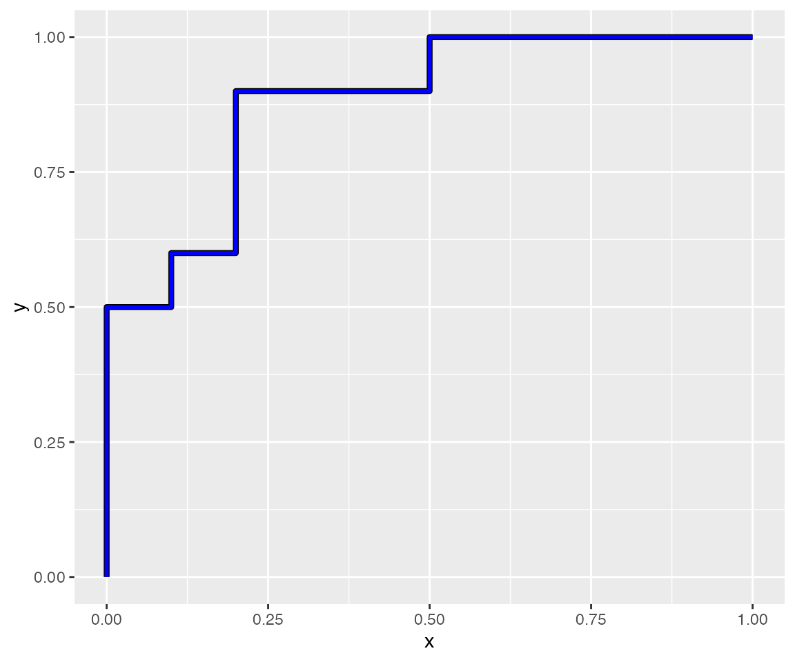
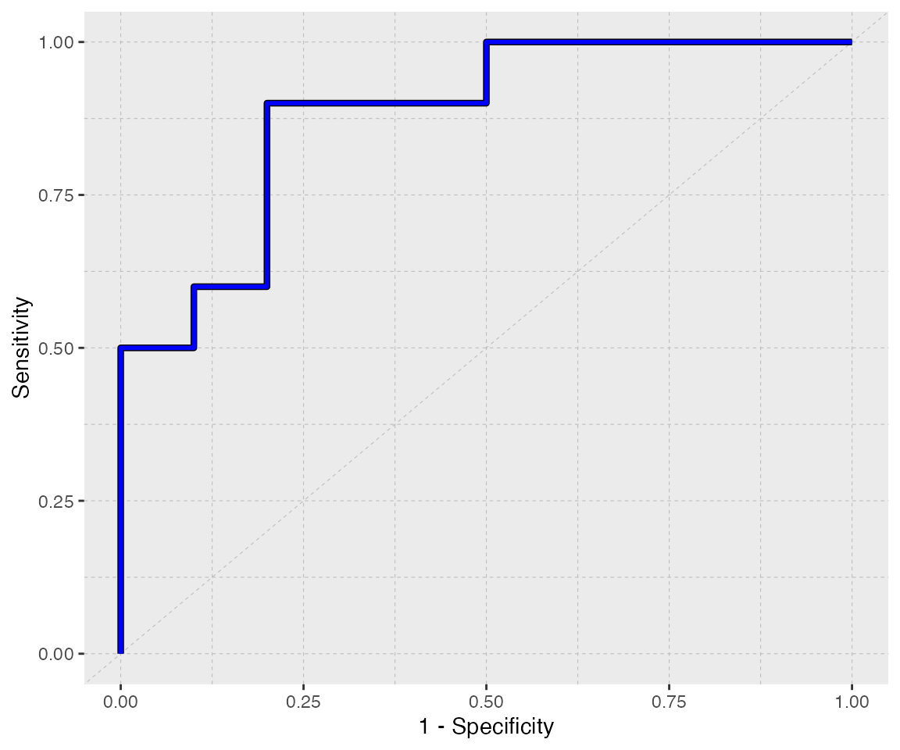
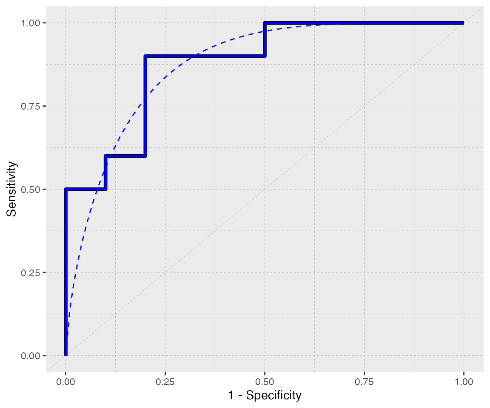
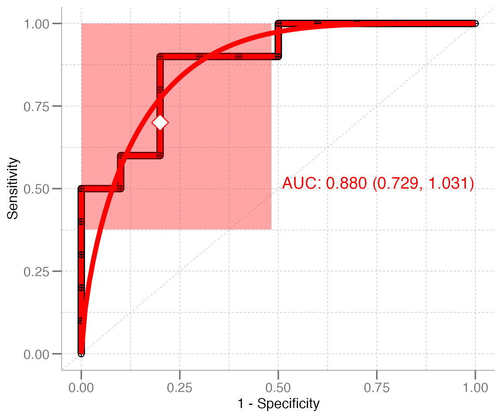
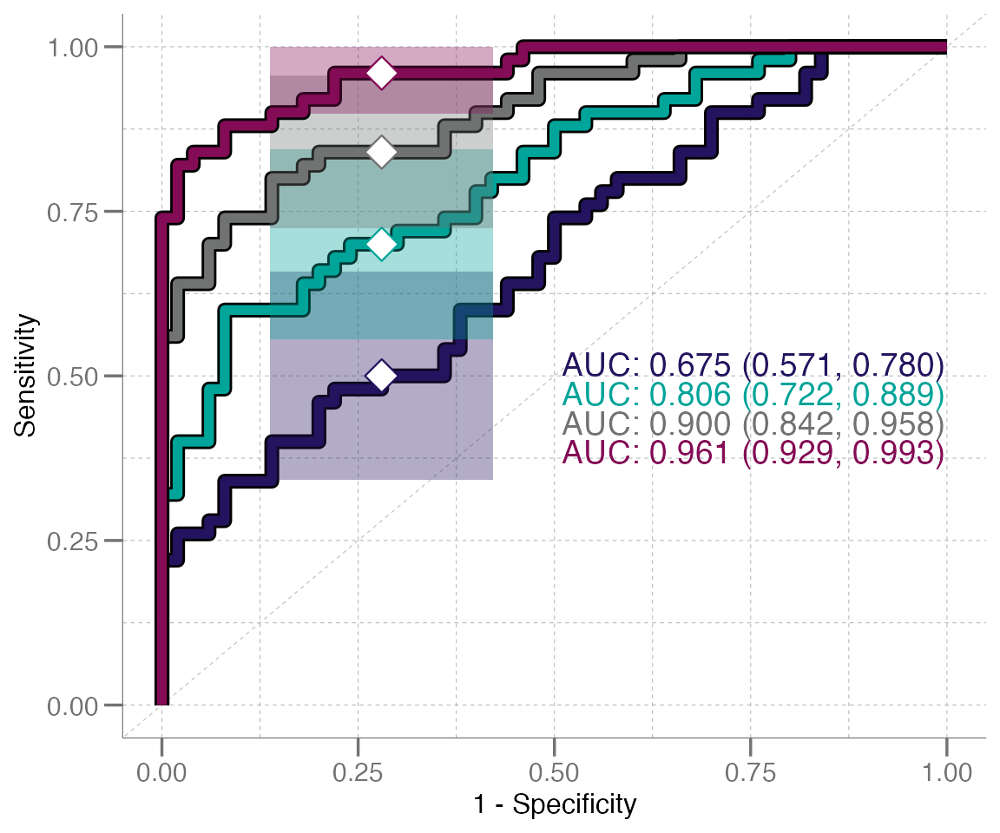
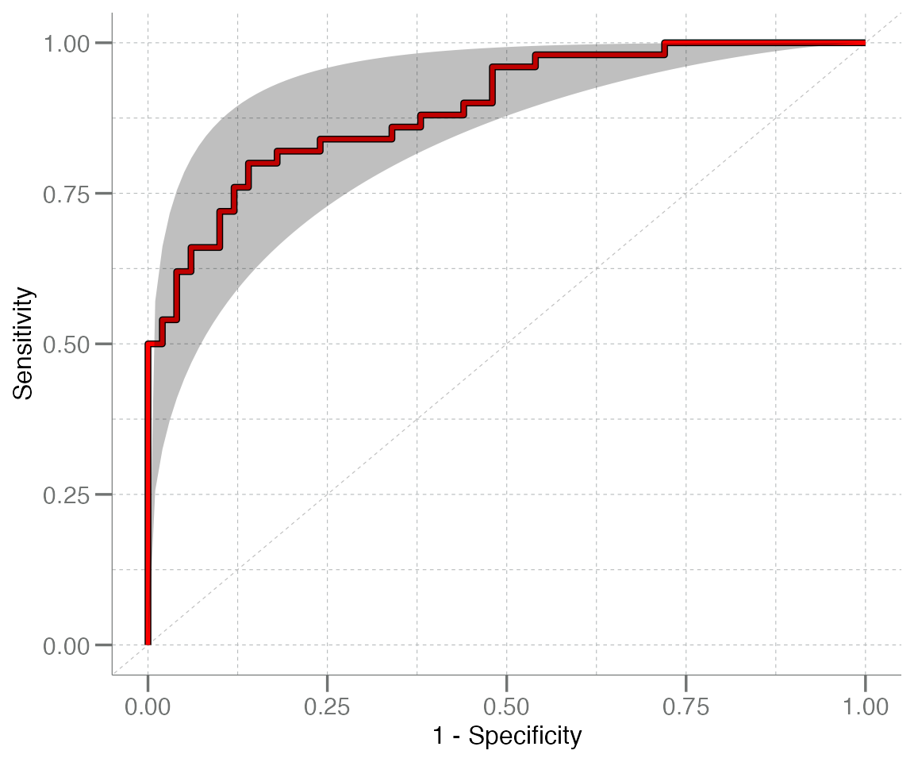
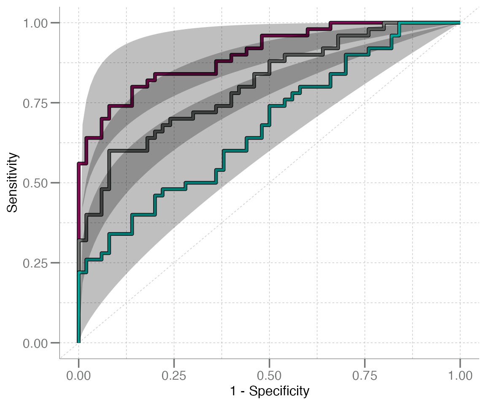

# Plotting ROC Curves

## Introduction & Brief Review of ROC Curves

This vignette describes how to plot ROC curves using functions found in
**libml**. Before starting on the code walk through, however, we will
provide a quick refresher on ROC curves. Skip to the next section if
this information is already familiar to you.

A **receiver operating characteristic curve**, or **ROC curve**, is a
graphical device that helps to visualize the discriminatory ability of a
binary classifier system.

To produce a ROC curve, the sensitivity (aka true positive rate) and
specificity (aka false positive rate) are calculated for different
values from a continuous set of data. To translate this into a
visualization, the ROC curve is made by plotting *sensitivity* (on the
y-axis) against *1–specificity* (on the x-axis) for the calculated
values.

A ROC curve that follows the diagonal (unit) line *y = x* produces false
positive results at the same rate as true positive results. Classifiers
with reasonable accuracy should have a ROC curve with its highest point
in the upper left corner of a plot, above the *y = x* line. This
accuracy can be quantified using the area under the ROC curve (AUC)
metric, which is a measure of the ability of a test to discriminate
between groups or correctly identify when a condition is present. The
higher the AUC, the better the model is at making accurate predictions.
For example, an AUC of 0.5 represents a test with no discriminating
ability (basically no better than chance), while an AUC of 1.0
represents a test with perfect discrimination. It is common to see a
graphical representations of a ROC curve paired with the corresponding
numeric AUC value.

**Fun fact:** The ROC curve was first developed by electrical engineers
and radar engineers during World War II, for the purpose of detecting
enemy objects in battlefields by operators of military radar receivers.
This is how the curve got its name.

## Plotting ROC Curves

ROC curves are a frequently used visualization tool for model
assessment, classifier performance, biomarker evaluation, and more.
Consequently, the **libml** package is well-equipped to easily and
quickly generate and visualize ROC curves and AUC values.

At the most basic level, individual ROC curves can be generated using
the
[`geom_roc()`](https://stufield.github.io/libml/dev/reference/geom_roc.md)
function. This function creates a
[ggplot2](https://ggplot2.tidyverse.org)-compatible *“geom”* layer that
generates and plots a ROC curve, utilizing the `ggplot2`-style grammar
of graphics.

The primary input for
[`geom_roc()`](https://stufield.github.io/libml/dev/reference/geom_roc.md)
is the output of
[`roc_xy()`](https://stufield.github.io/libml/dev/reference/roc_xy.md)
(also from **libml**), and this is generally used in support of the
wrapper functions
[`plot_emp_roc()`](https://stufield.github.io/libml/dev/reference/plot_emp_roc.md)
and
[`plot_boot_roc()`](https://stufield.github.io/libml/dev/reference/plot_boot_roc.md).
These functions generate ROC curve plots, but provide more advanced
options for plot annotation and confidence interval generation,
respectively.

To illustrate how
[`geom_roc()`](https://stufield.github.io/libml/dev/reference/geom_roc.md)
can be used to create a ROC curve, we must first generate an example
data set to work with. The
[`roc_xy()`](https://stufield.github.io/libml/dev/reference/roc_xy.md)
function will then create the `x` and `y` values required to plot the
curve from this data set.

``` r
# Generate example data
true <- rep(c("control", "disease"), each = 10)
pred <- withr::with_seed(8, c(rnorm(10, mean = 0.4, sd = 0.2),
                              rnorm(10, mean = 0.6, sd = 0.2)))

# Calculate x & y coords for the ROC curve using data generated above
rocxy <- roc_xy(true, pred, "disease") |>
  data.frame()     # must cast to a data frame for ggplot()
head(rocxy)
#>   x   y
#> 1 0 0.0
#> 2 0 0.1
#> 3 0 0.2
#> 4 0 0.3
#> 5 0 0.4
#> 6 0 0.5
```

Now that we have obtained the coordinates for the ROC curve, we can use
[`ggplot()`](https://ggplot2.tidyverse.org/reference/ggplot.html) and
[`geom_roc()`](https://stufield.github.io/libml/dev/reference/geom_roc.md)
to plot the curve:

``` r
# Set up ggplot2-style plot mappings
ggplot(data = rocxy, mapping = aes(x = x, y = y)) +
  geom_roc(color = "blue")    # add curve layer to plot
```



You’ll notice that this is a very simplistic plot; because
[`geom_roc()`](https://stufield.github.io/libml/dev/reference/geom_roc.md)
merely creates the ROC curve layer (without modifying the axis labels,
plot title, etc.), the plot above is pretty basic and uses the default
ggplot2 theme. We can class it up a bit by applying and/or modifying
additional theme elements:

``` r
p <- ggplot(data = rocxy, aes(x = x, y = y)) +
  labs(x = "1 - Specificity", y = "Sensitivity") +
  theme(panel.grid = element_blank()) +
  geom_abline(slope = 1, intercept = 0, size = 0.2,
              linetype = "dashed", color = "grey") +
  theme(panel.grid.minor = element_line(linetype = "dashed",
                                        color = "grey", size = 0.2),
        panel.grid.major = element_line(linetype = "dashed",
                                        color = "grey", size = 0.2)) +
  geom_roc(color = "blue")
#> Warning: Using `size` aesthetic for lines was deprecated in ggplot2 3.4.0.
#> ℹ Please use `linewidth` instead.
#> This warning is displayed once per session.
#> Call `lifecycle::last_lifecycle_warnings()` to see where this warning was generated.
#> Warning: The `size` argument of `element_line()` is deprecated as of ggplot2 3.4.0.
#> ℹ Please use the `linewidth` argument instead.
#> This warning is displayed once per session.
#> Call `lifecycle::last_lifecycle_warnings()` to see where this warning was generated.

p
```



A fitted line can be layered on top of this curve using
[`geom_rocfit()`](https://stufield.github.io/libml/dev/reference/geom_roc.md).
Like other `geom`s, features of the fit line (like color, size, line
type, etc.) can be customized:

``` r
p + geom_rocfit(data = rocxy, color = "blue", lty = "dashed")
```



You’ll notice that it took a decent number of lines of code to get to
this point, even though the final product is still a rather simplistic
plot. The wrapper functions mentioned previously alleviate this issue by
baking all of these steps into one single function.

## Convenient Wrappers

### `plot_emp_roc()`

It’s often advantageous to annotate ROC curves with AUC values, draw
points along the curve, and add other visual features to make the plot
easier to interpret and more informative. Additionally, when comparing
multiple ROC curves, it’s useful to layer the curves on top of each
other to aid in visual comparison and simplify the overall presentation.

However, adding annotation and/or text layers and customizing theme
elements can become labor intensive and messy when there are 2+ curves
(plus fit lines, in some cases) to plot. The wrapper function
[`plot_emp_roc()`](https://stufield.github.io/libml/dev/reference/plot_emp_roc.md)
streamlines this process by generating custom annotations under the
hood.

``` r
plot_emp_roc(truth     = true,
             predicted = pred,
             pos_class = "disease",
             plot_fit  = "both",  # both ROC and fit line should be drawn
             col       = "red",
             shape     = 10)
```



The plots generated by
[`plot_emp_roc()`](https://stufield.github.io/libml/dev/reference/plot_emp_roc.md)
can also be layered, to compare ROC curves generated from various data
sets:

``` r
# Generate additional datasets
n <- 50
data <- lapply(1:4, function(.x) {
  withr::with_seed(101,
    data.frame(truth = rep(c("control", "disease"), each = n),
               pred  = c(rnorm(n), rnorm(n, mean = .x / 2)))
  )
}) |> setNames(paste0("df_", 1:4L))

# Create a color palette to distinguish the curves
cols <- unlist(libml:::col_palette)

# Create a base plot & layer additional curves layered on top
plot_emp_roc(data$df_1$truth, data$df_1$pred, "disease", col = cols[1L]) +
  plot_emp_roc(data$df_2$truth, data$df_2$pred, "disease", col = cols[2L], add = 1) +
  plot_emp_roc(data$df_3$truth, data$df_3$pred, "disease", col = cols[3L], add = 2) +
  plot_emp_roc(data$df_4$truth, data$df_4$pred, "disease", col = cols[4L], add = 3)
```



**Note:** when adding plots together, the `add =` argument (integer)
*must* be passed and set to the plotting layer (zero indexed) for the
desired curve. This is used to stagger the AUC text annotation values so
that they do not overlap.

------------------------------------------------------------------------

### `plot_boot_roc()`

This system/syntax can also be used for the other wrapper function,
[`plot_boot_roc()`](https://stufield.github.io/libml/dev/reference/plot_boot_roc.md),
which has a similar syntax to
[`plot_emp_roc()`](https://stufield.github.io/libml/dev/reference/plot_emp_roc.md)
and is also built around
[`geom_roc()`](https://stufield.github.io/libml/dev/reference/geom_roc.md).
The primary difference between these two is that
[`plot_emp_roc()`](https://stufield.github.io/libml/dev/reference/plot_emp_roc.md)
has more options for customizing the plot appearance, while
[`plot_boot_roc()`](https://stufield.github.io/libml/dev/reference/plot_boot_roc.md)
is designed to generate and visualize bootstrapped CI95 intervals via a
shaded region in addition to the ROC curve.

``` r
# Simulate a new example dataset for this example
n <- 50
true <- rep(c("control", "disease"), each = n)
pred <- withr::with_seed(1, c(rnorm(n, 0.2, 0.2), rnorm(n, 0.5, 0.2)))
plot_boot_roc(true, pred, "disease", shade.color = "blue", color = "red", nboot = 200)
#> Warning in geom_roc(data = rocxy, aes(x = x, y = y), ...): Ignoring unknown parameters:
#> `shade.colour`
```



These plots can also be layered, with similar syntax to
[`plot_emp_roc()`](https://stufield.github.io/libml/dev/reference/plot_emp_roc.md):

``` r
plot_boot_roc(data$df_3$truth, data$df_3$pred, "disease", shade.color = cols[4L],
              color = cols[4L], nboot = 200) +
  plot_boot_roc(data$df_2$truth, data$df_2$pred, "disease", shade.color = cols[3L],
                color = cols[3L], nboot = 200, add = TRUE) +
  plot_boot_roc(data$df_1$truth, data$df_1$pred, "disease", shade.color = cols[2L],
                color = cols[2L], nboot = 200, add = TRUE)
#> Warning in geom_roc(data = rocxy, aes(x = x, y = y), ...): Ignoring unknown parameters: `shade.colour`
#> Ignoring unknown parameters: `shade.colour`
#> Ignoring unknown parameters: `shade.colour`
```


