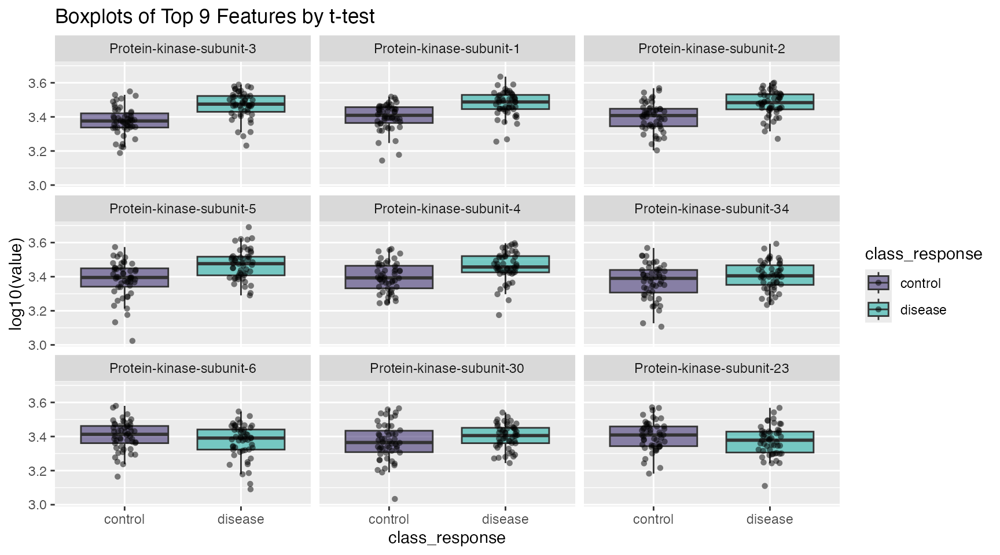

# Using Nested Tibbles for Univariate Analysis

## Introduction to List-Columns

This vignette utilizes one of the most esoteric concepts in the
[tidyverse](https://www.tidyverse.org) list columns. The
[tidyverse](https://www.tidyverse.org) is based on tidy data, which is
based on tables. Tables simplify data analysis by making data easy to
use, just like Arabic numerals simplify math by making numbers easy to
use. But you may not know that tables can make other things easy to use
as well. You can use tables to store models, lists, and other tables in
a list column. The table will store the products of your data analysis
in an organized way, and you can manipulate the table with other
familiar [tidyverse](https://www.tidyverse.org) tools such as
[dplyr](https://dplyr.tidyverse.org) and
[purrr](https://purrr.tidyverse.org). In fact, they are *designed* work
together. This vignette will look at how you can make list columns and
use them in a common use-case example.

- A great RStudio webinar from Garrett Grolemund can be found here: [how
  to work with list
  columns](https://rstudio.com/resources/webinars/how-to-work-with-list-columns/)
- As well as a nice tutorial on how list columns incorporate with the
  [purrr](https://purrr.tidyverse.org) package by Jenny Bryan can be
  found here: [purrr and
  list-columns](https://jennybc.github.io/purrr-tutorial/ls13_list-columns.html)

### In `libml`

See
[`calc_univariate()`](https://stufield.github.io/libml/dev/reference/calc_univariate.md).

------------------------------------------------------------------------

## Example Analysis

A very common task in proteomics is a univariate analysis of features.
This means that each feature is analyzed independently and the exact
same statistical test is applied repeatedly over the columns of feature
data. This is so common it forms the basis of most preliminary analyses.

As with most analyses, start by pre-processing the data via 3 steps:

- log10-transform
- center to zero mean
- scale to unit variance

``` r
# pre-process simulated data
data  <- wranglr::simdata
feats <- grep("^seq.", names(data), value = TRUE)
for ( i in feats ) {
  data[[i]] <- log10(data[[i]])
}
data  <- center_scale(data)
```

Next, initiate a table ([tibble](https://tibble.tidyverse.org)) of
feature annotations (secondary information). This will be the starting
point of the ever-growing analysis “object”:

``` r
t_tbl <- attr(data, "Col.Meta") |>
  dplyr::mutate(feature = libml:::add_seq(SeqId)) |>
  select(feature, SeqId, TargetFullName, EntrezGeneSymbol, UniProt)

head(t_tbl)
#> # A tibble: 6 × 5
#>   feature     SeqId   TargetFullName           EntrezGeneSymbol UniProt
#>   <chr>       <chr>   <chr>                    <chr>            <chr>  
#> 1 seq.2802.68 2802-68 Protein-kinase-subunit-1 4HG              NBXVHJ 
#> 2 seq.9251.29 9251-29 Protein-kinase-subunit-2 QKG              UL9R2V 
#> 3 seq.1942.70 1942-70 Protein-kinase-subunit-3 JHQ8             Z6PS9G 
#> 4 seq.5751.80 5751-80 Protein-kinase-subunit-4 NV6Y             OBX5GT 
#> 5 seq.9608.12 9608-12 Protein-kinase-subunit-5 IHW              72CM6T 
#> 6 seq.3459.49 3459-49 Protein-kinase-subunit-6 JP4B             OKGFQ2
```

### Calculate *t*-tests

With the above preparation steps in place, iterate over the rows and add
columns as the analysis grows, with a combination of
[`dplyr::mutate()`](https://dplyr.tidyverse.org/reference/mutate.html)
and [`purrr::map()`](https://purrr.tidyverse.org/reference/map.html):

``` r
t_tbl <- t_tbl |>
  mutate(
    t_stat  = map(feature, ~ as.formula(paste(.x, "~ class_response")) |>
                  t.test(data = data)),        # fit t-tests
    p_value = map_dbl(t_stat, "p.value"),      # pull out p-values
    fdr     = p.adjust(p_value, method = "fdr") # FDR test correction
  ) |>
  arrange(p_value) |>           # Re-order by `p-value`
  mutate(rank = row_number())   # add ranks column

# each row represents a feature
length(feats)
#> [1] 40
nrow(t_tbl)
#> [1] 40

# the analysis table
t_tbl
#> # A tibble: 40 × 9
#>    feature     SeqId   TargetFullName         EntrezGeneSymbol UniProt t_stat  p_value     fdr  rank
#>    <chr>       <chr>   <chr>                  <chr>            <chr>   <list>    <dbl>   <dbl> <int>
#>  1 seq.1942.70 1942-70 Protein-kinase-subuni… JHQ8             Z6PS9G  <htest> 6.91e-8 2.76e-6     1
#>  2 seq.2802.68 2802-68 Protein-kinase-subuni… 4HG              NBXVHJ  <htest> 1.57e-6 2.95e-5     2
#>  3 seq.9251.29 9251-29 Protein-kinase-subuni… QKG              UL9R2V  <htest> 2.21e-6 2.95e-5     3
#>  4 seq.9608.12 9608-12 Protein-kinase-subuni… IHW              72CM6T  <htest> 1.71e-5 1.71e-4     4
#>  5 seq.5751.80 5751-80 Protein-kinase-subuni… NV6Y             OBX5GT  <htest> 3.63e-4 2.90e-3     5
#>  6 seq.3300.26 3300-26 Protein-kinase-subuni… G6Q              HPTSIG  <htest> 8.41e-2 4.49e-1     6
#>  7 seq.3459.49 3459-49 Protein-kinase-subuni… JP4B             OKGFQ2  <htest> 8.58e-2 4.49e-1     7
#>  8 seq.8142.63 8142-63 Protein-kinase-subuni… XOR              68Z14U  <htest> 9.06e-2 4.49e-1     8
#>  9 seq.1130.49 1130-49 Protein-kinase-subuni… X6K              IKSPO3  <htest> 1.01e-1 4.49e-1     9
#> 10 seq.3896.5  3896-5  Protein-kinase-subuni… BZFW             584QKS  <htest> 1.41e-1 5.00e-1    10
#> # ℹ 30 more rows
```

Done! We now have a self-contained
[tibble](https://tibble.tidyverse.org) object with the entire t-test
analysis. The `t_stat` list-column contains the “t-tests” and the
neighboring columns contain the corresponding *p*-values and *fdr*
corrections. The rows (features) are ordered by *p*-value and
appropriate rank order has been added.

------------------------------------------------------------------------

### Plotting in [ggplot2](https://ggplot2.tidyverse.org)

Plotting can be achieved in three basic steps:

- Set up a target map which maps `SeqIds` -\> `Targets` (protein names)
  - i.e. for plot titles
- Set up plotting data table
- Plot with [ggplot2](https://ggplot2.tidyverse.org)

#### Dictionary map of feature -\> protein names

``` r
target_map <- head(t_tbl, 9L) |>              # mapping table
  select(feature, Target = TargetFullName)    # feature -> Target (& rename)

target_map
#> # A tibble: 9 × 2
#>   feature     Target                   
#>   <chr>       <chr>                    
#> 1 seq.1942.70 Protein-kinase-subunit-3 
#> 2 seq.2802.68 Protein-kinase-subunit-1 
#> 3 seq.9251.29 Protein-kinase-subunit-2 
#> 4 seq.9608.12 Protein-kinase-subunit-5 
#> 5 seq.5751.80 Protein-kinase-subunit-4 
#> 6 seq.3300.26 Protein-kinase-subunit-34
#> 7 seq.3459.49 Protein-kinase-subunit-6 
#> 8 seq.8142.63 Protein-kinase-subunit-30
#> 9 seq.1130.49 Protein-kinase-subunit-23
```

#### reshape data into long-format for plotting

``` r
plot_tbl <- undo_center_scale(data) |>                 # log-space; no center-scale
  select(class_response, all_of(target_map$feature)) |># top 9 features
  pivot_longer(cols = -class_response, names_to = "feature", values_to = "val") |>
  left_join(target_map) |>
  # order factor levels by 't_tbl' rank to order plots below
  mutate(Target = factor(Target, levels = target_map$Target))
#> Joining with `by = join_by(feature)`

plot_tbl
#> # A tibble: 900 × 4
#>    class_response feature       val Target                   
#>    <chr>          <chr>       <dbl> <fct>                    
#>  1 control        seq.1942.70  3.34 Protein-kinase-subunit-3 
#>  2 control        seq.2802.68  3.34 Protein-kinase-subunit-1 
#>  3 control        seq.9251.29  3.43 Protein-kinase-subunit-2 
#>  4 control        seq.9608.12  3.43 Protein-kinase-subunit-5 
#>  5 control        seq.5751.80  3.44 Protein-kinase-subunit-4 
#>  6 control        seq.3300.26  3.35 Protein-kinase-subunit-34
#>  7 control        seq.3459.49  3.36 Protein-kinase-subunit-6 
#>  8 control        seq.8142.63  3.31 Protein-kinase-subunit-30
#>  9 control        seq.1130.49  3.44 Protein-kinase-subunit-23
#> 10 control        seq.1942.70  3.40 Protein-kinase-subunit-3 
#> # ℹ 890 more rows
```

#### plot via `ggplot2`

``` r
plot_tbl |>
  ggplot(aes(x = class_response, y = val, fill = class_response)) +
  geom_boxplot(alpha = 0.5, outlier.shape = NA) +
  scale_fill_manual(values = c("#24135F", "#00A499")) +
  geom_jitter(shape = 16, width = 0.1, alpha = 0.5) +
  facet_wrap(~ Target) +
  ggtitle("Boxplots of Top 9 Features by t-test") +
  labs(y = "log10(value)")
```


